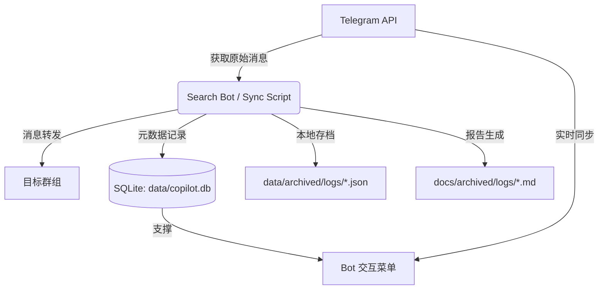

# 📺 Telegram Video Copilot

> 从指定 Telegram 频道/群组自动归档视频到私人群组，支持搜索、本地元数据存档。

## 📚 项目文档体系

为方便查阅，本项目采用三位一体的文档结构：

1.  **[Bot 核心机制 (本文件)](#核心机制)**：记录本项目自研的计数、编号、ID 映射及增量更新逻辑。
2.  **[Telegram 官方底层机制](docs/telegram_mechanics.md)**：记录关于 Raw Messages 与 Albums 的官方 API 行为。
3.  **[Agent 交互与守则](docs/agent_guidelines.md)**：记录开发者与 AI 助手的操作规范。

---

## 🏗️ 项目结构与架构

本项目采用了模块化设计，确保同步、备份与检索逻辑的清晰隔离。

### 1. 目录结构规范

```bash
telegramporncopilot/
├── src/                     # 程序源码根目录
│   ├── sync_mode/           # 🔄 同步模式核心逻辑 (转发与增量控制)
│   ├── backup_mode/         # 💾 备份模式逻辑 (元数据抓取与快照生成)
│   ├── search_mode/         # 🔍 搜索模式逻辑 (数据库检索与索引维护)
│   ├── utils/               # 🛠️ 辅助工具 (离线通知、调试脚本等)
│   ├── db.py                # 🗄️ 数据库操作核心类 (Sqlite3 封装)
│   └── search_bot.py        # 🤖 Bot 交互界面主入口
├── data/                    # 动态数据目录
│   ├── sessions/            # Telegram 会话文件
│   ├── archived/            # 机器可读的 JSON 历史快照
│   └── copilot.db           # Bot 运行的核心 SQLite 数据库
├── docs/                    # 文档中心
│   ├── archived/            # 自动生成的离线日志报表 (Markdown)
│   └── templates/           # 文档模板
├── .env                     # 密钥与配置 (API_ID, BOT_TOKEN 等)
└── start_bot.bat            # Windows 一键启动脚本
```

### 2. 数据流向概览



### 3. 存储与元数据说明

- **数据库 (data/copilot.db)**：Bot 运行的核心“大脑”。负责 UI 渲染（同步一览、频道列表）、断点记录（`last_offset`）以及资源的全局独立编号管理。
- **本地 JSON 记录 (data/archived/logs/)**：原始数据的机器可读备份。用于数据恢复或二次分析，包含消息详情、发送者、原始 ID 等。
- **离线文档 (docs/archived/logs/)**：用户的人工查阅入口。由同步/备份逻辑自动生成的 `.md` 报告。_注意：Bot 界面本身并不读取这些文件，它们仅供人工参考。_

---

<a name="核心机制"></a>

## ⚙️ Bot 自研核心机制

本项目不仅仅是简单的搬运工，其核心价值在于建立了一套稳定、可追溯的 **“资源索引体系”**。

### 1. 唯一资源 ID 映射 (Resource ID Mapping)

- **机制**：无论通过 `/sync` 还是 `/backup` 扫描到消息，系统会立即为该资源分配一个永久性的内部 ID。
- **标准化**：统一使用 Telethon 标准的 **signed Peer ID**，彻底解决了频道重命名、多端同步导致的 ID 不一致问题。

### 2. 消息分类与统计口径

为确保统计数据自洽，系统将消息划分为两大核心类别：

- **带资源消息**：具备实际媒体载体（视频、图片、GIF、文件）或网页预览。
- **文本消息**：纯文字或无预览的链接。
- **逻辑锁定**：`总消息数 = 带资源数 + 文本数`。携带链接的消息会并行分配专用的“链接号”。

### 3. 多维编号图鉴 (Numbering Reference)

系统在 Telegram 转发头、本地 JSON 和离线 MD 中提供了多粒度编号：

- **第 X 组消息 (📦)**：物理转发顺序。
- **资源号 / 文字号 (📦/✍️)**：分类互补编号。
- **总资源号 (🔢)**：媒体文件的全局物理计数。
- **分项明细 (🎬/🖼️/🎞️)**：视频、图片、GIF 的专项独立编号。

### 4. 增量自愈与接力 (Incremental Self-healing)

- **增量接力**：每次增量任务只认本地最新的 JSON 快照。系统会提取其最后一条 ID 作为断点，向下兼容套娃式增量。
- **ID 索引预判**：启动备份前，系统会自动扫描 `data/metadata` 建立 `ID -> 物理文件夹` 的映射索引。即便频道由于改名更换了文件夹，增量探测也能 100% 成功，绝不重跑。

### 5. 中断保护机制 (Partial Backup Handling)

- **自动打标**：被手动停止或异常中断的备份会自动更名为 `_PARTIAL.json`。
- **逻辑回溯**：下次增量备份会自动跳过所有 `_PARTIAL` 文件，回溯搜索上一个完整的备份点，确保数据的连续性和完整性。

---

## 🚀 工作模式简述

### 1. 🔄 同步模式 (`/sync`)

- **目标**：往目标群转发，保留原始上下文。
- **速度**：10~30 条/分钟 (受 Telegram Flood Wait 限制)。

### 2. 💾 备份模式 (`/backup`)

- **目标**：全量拉取历史记录到本地，不转发消息。
- **速度**：3,000~5,000 条/分钟。

### 3. 🔍 检索分析 (`/search`)

- **目标**：本地检索关键字、创作者、模特，支持直达链接 (Deep Link)。

### 4. 📥 手动录入 (`/ingest`)

- **目标**：将转发给 Bot 的零散资源入库并打标。

---

## 🛠️ 快速操作

- **刷新元数据**: `/refresh` (Bot 指令) 或 `python src/sync_mode/update_docs.py`
- **查看同步状态**: 进入 `/sync` 菜单 -> 第 6 项
- **查看备份状态**: 进入 `/backup` 菜单 -> 第 5 项
