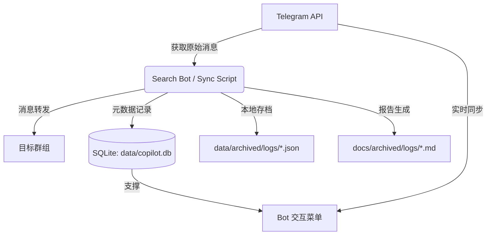

# 📺 Telegram Video Copilot

> 面向 Telegram 频道/群组的双 Bot 资源归档系统，支持同步、备份、检索、打标与本地元数据存档。

## 📚 项目文档体系

为方便查阅，本项目采用三位一体的文档结构：

1.  **[Bot 核心机制 (本文件)](#核心机制)**：记录本项目自研的计数、编号、ID 映射及增量更新逻辑。
2.  **[Telegram 官方底层机制](docs/telegram_mechanics.md)**：记录关于 Raw Messages 与 Albums 的官方 API 行为。
3.  **[Agent 交互与守则](docs/agent_guidelines.md)**：记录开发者与 AI 助手的操作规范。

---

## 🏗️ 项目结构与架构

本项目采用模块化设计，并在 V9.0 起引入 **双 Bot 逻辑隔离、底层资源共享** 架构：

- **主 Bot `tgporncopilot`**：负责“整理 / 精品 / 极品”等重度管辖目录。
- **副 Bot `my_porn_private_bot`**：负责另一套私密目录与目标库维护。

两者共享同一个 `data/copilot.db`，但通过：

- `bot_name`
- `target_groups`
- `sync_runs / backup_runs`
- `entities / tags / candidates`

实现逻辑隔离。

### 1. 目录结构规范

```bash
tgporncopilot/
├── _agent/                 # Agent 工作流与系统维护文档
├── src/                     # 程序源码根目录
│   ├── sync_mode/           # 🔄 同步模式核心逻辑 (转发与增量控制)
│   ├── backup_mode/         # 💾 备份模式逻辑 (元数据抓取与快照生成)
│   ├── search_mode/         # 🔍 搜索模式逻辑 (数据库检索与索引维护)
│   ├── utils/               # 🛠️ 辅助工具 (离线通知、调试脚本等)
│   ├── db.py                # 🗄️ 数据库操作核心类 (Sqlite3 封装)
│   └── search_bot.py        # 🤖 Bot 交互界面主入口
├── data/                    # 动态数据目录
│   ├── sessions/            # Telegram 会话文件 (按 Bot 隔离)
│   ├── archived/            # 机器可读的 JSON 历史快照 / 同步日志
│   ├── entities/            # 按 Bot 隔离的实体数据
│   └── copilot.db           # Bot 运行的核心 SQLite 数据库
├── docs/                    # 文档中心
│   ├── archived/            # 自动生成的离线日志报表 (Markdown)
│   ├── entities/            # 候选池与当前实体可视化
│   └── tags/                # P3 导出的频道 tags 预览
├── tools/sorter/            # P1.5 Web 分拣台
├── .env                     # 密钥与配置 (API_ID, BOT_TOKEN 等)
├── start_tgporncopilot.bat
└── start_my_porn_private_bot.bat
```

### 2. 数据流向概览



### 3. 存储与元数据说明

- **数据库 (`data/copilot.db`)**：系统核心数据库，承担：
    - `sync_runs / backup_runs` 运行记录
    - `messages` 原始消息 -> 目标群消息映射
    - `global_messages` 全局可检索消息池
    - `sync_offsets / backup_offsets` 增量断点
    - `target_groups` 目标群管理
    - `resource_counters` 独立编号体系
- **本地 JSON 记录 (`data/archived/**`)**：机器可读历史材料，用于恢复、发现流水线与二次分析。
- **离线 Markdown (`docs/archived/**`, `docs/tags/**`)**：面向人工核对的静态视图。_注意：Bot 搜索本身不直接读取这些 Markdown。_

---

<a name="核心机制"></a>

## ⚙️ Bot 自研核心机制

本项目不仅仅是简单的搬运工，其核心价值在于建立了一套稳定、可追溯的 **“资源索引体系”**。

### 1. 唯一资源 ID 映射 (Resource ID Mapping)

- **机制**：无论通过 `/sync` 还是 `/backup` 首次见到消息，系统都会为其分配或回收稳定的内部资源编号。
- **双层映射**：
    - `global_messages` 记录原始消息元信息；
    - `messages` 记录原始消息与私密库转发消息的映射；
- **标准化**：内部统一使用规范化后的 Telegram Peer ID，避免 `-100xxxx` / `-xxxx` 混用导致的关联失败。

### 2. 消息分类与统计口径

为确保统计数据自洽，系统将消息划分为两大核心类别：

- **带资源消息**：具备实际媒体载体（视频、图片、GIF、文件）或网页预览。
- **文本消息**：纯文字或无预览的链接。
- **逻辑锁定**：`总消息数 = 带资源数 + 文本数`。携带链接的消息会并行分配专用的“链接号”。

### 3. 多维编号图鉴 (Numbering Reference)

系统在 Telegram 转发头、本地 JSON 和离线 MD 中提供了多粒度编号：

- **第 X 组消息 (📦)**：物理转发顺序。
- **资源号 / 文字号 (📦/✍️)**：分类互补编号。
- **总资源号 (🔢)**：媒体文件的全局物理计数。
- **分项明细 (🎬/🖼️/🎞️)**：视频、图片、GIF 的专项独立编号。

### 4. 增量自愈与接力 (Incremental Self-healing)

- **同步增量**：依赖 `sync_offsets.last_msg_id`，只拉取每个频道断点之后的新消息。
- **备份增量**：依赖 `backup_offsets.last_msg_id`，并兼容扫描历史备份文件回推断点。
- **名称自愈**：通过 `channel_names` 锁定频道 canonical/latest 名称，避免频道改名造成目录和日志断层。
- **历史修复**：数据库层内置 chat_id 规范化与映射体检/修复能力，避免旧数据影响搜索命中。

### 5. 中断保护机制 (Partial Backup Handling)

- **自动打标**：被手动停止或异常中断的备份会自动更名为 `_PARTIAL.json`。
- **逻辑回溯**：下次增量备份会自动跳过所有 `_PARTIAL` 文件，回溯搜索上一个完整的备份点，确保数据的连续性和完整性。

---

## 🚀 四大工作模式

### 1. 🔄 同步模式 (`/sync`)

- **目标**：将源频道消息转发到目标私密库，并建立 `messages` 映射。
- **关键表**：`sync_runs`、`messages`、`sync_offsets`、`target_groups`
- **说明**：支持局部/全局、增量/全时间轴、测试/正式、目标群切换、回滚等功能。

### 2. 💾 备份模式 (`/backup`)

- **目标**：将源频道历史完整抓取到本地 JSON / Markdown 快照，不转发消息。
- **关键表**：`backup_runs`、`backup_offsets`、`channel_names`
- **说明**：支持中断续传、`_PARTIAL` 半成品隔离、完整快照覆盖式输出。

### 3. 🔍 检索分析 (`/search`)

- **目标**：检索关键字、创作者、演员、标签，并可直达已同步消息。
- **关键层**：
    - 直接搜索：`global_messages + messages`
    - 发现流水线：P0 / P1 / P1.5 / P2 / P3
- **说明**：支持从海量备份中自动发现新实体，并通过 Web Sorter 分拣打标后回写数据库与导出 tags 文档。

### 4. 📥 手动补全 (`/ingest` / 转发触发)

- **目标**：对既有资源做人工补录、多字段修正和回写。
- **说明**：适合修正 creator / actor / keyword / supplement 等结构化信息。

---

## 🛠️ 快速操作

- **刷新元数据**：`/refresh` 或运行 `src/sync_mode/update_docs.py`
- **查看同步状态**：进入 `/sync` 菜单 -> 第 6 项
- **查看备份状态**：进入 `/backup` 菜单 -> 第 5 项
- **启动发现流水线**：进入 `/search` -> `🔄 更新词库`
- **切换目标群**：进入 `/sync` -> `7. 目标群聊管理`
- **系统百科**：详见 `_agent/workflows/bot_system.md`
