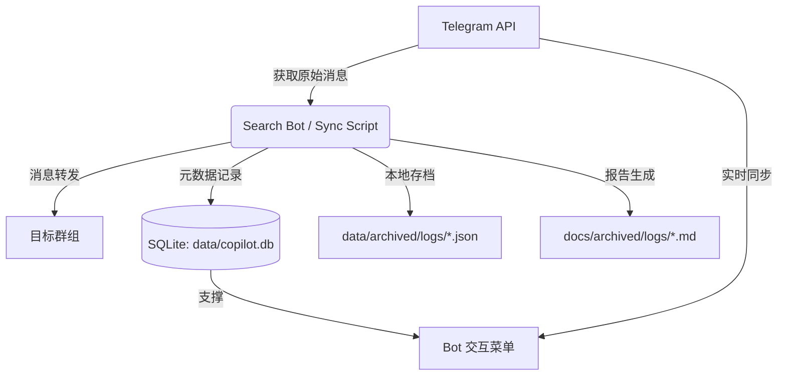

# TG Porn Copilot 项目架构说明

## 1. 核心设计理念

本项目是一个 Telegram 消息同步与归档助手，其详细逻辑可参考：

- **[Bot 核心机制 (README.md)](../README.md)**：自研的计数、ID 标准化、增量自愈机制。
- **[Telegram 官方底层机制](telegram_mechanics.md)**：Raw Messages 与 Albums 的官方 API 行为。
- **[Agent 交互与守则](agent_guidelines.md)**：开发者与 AI 助手的操作规范。

## 2. 数据流向图

Bot 的运行涉及三种主要数据形态：

## 3. 存储与元数据说明

### 3.1 数据库 (data/copilot.db)

**作用**：Bot 运行的核心大脑。

- **UI 渲染**：Bot 的同步情况一览、回滚记录、频道列表（部分）均直接查询此数据库。
- **断点记录**：记录每个频道的 `last_offset`，确保增量同步。
- **自动编号**：管理视频、图片、文字等资源的全局独立编号。

### 3.2 本地 JSON 记录 (data/archived/logs/)

**作用**：原始数据的机器可读备份。

- 包含一次同步中所有处理过的消息详情（含发送者、原始 ID、文本、媒体类型等）。
- 用于未来的数据恢复或二次分析。

### 3.3 离线文档 (docs/archived/logs/)

**作用**：提供给用户的人工查阅入口。

- 同步结束后，逻辑会自动内联生成对应的 `.md` 文件。
- **注意**：Bot 的交互 UI **并不读取**这些文件。它们仅作为离线备份和文档参考，即便删除这些文件，Bot 的功能也不会受到影响。

## 4. 目录结构规范 (重构后)

- `src/`：项目源码根目录。
  - `src/sync_mode/`：同步模式相关的核心逻辑。
  - `src/backup_mode/`：备份模式相关的逻辑。
  - `src/search_mode/`：搜索模式相关的逻辑。
  - `src/utils/`：辅助工具（如 `send_offline.py`）、调试脚本。
  - `src/db.py`：数据库操作核心类。
  - `src/search_bot.py`：Bot 交互界面主入口。
- `data/`：动态数据目录（数据库、JSON 日志、Session 文件等）。
- `docs/`：文档中心（订阅列表、同步报告、架构说明）。
